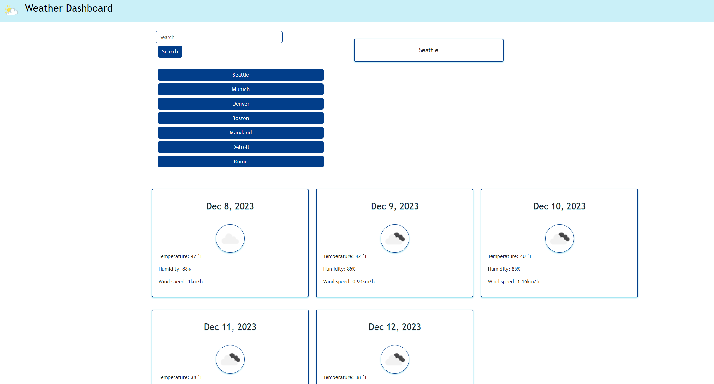

# Weather Forecast Dashboard

## Description

The purpose of this program is to create a dynamic weather forecast app that displays the current and future forecast for the following 4 days. the user is able to select which city they would like to view at any given time.

- We created this project to have access to a reliable and easy to use weather app that users can find information about weather in whichever city location they choose.

## Installation

this project runs as a web application which can be accessed through any standard web browser.

## Usage

the user searches for a city and is present with with the current and future weather conditions for that city, which is organized by city name, the date, and visual icon indicators for which type of weather is or will occur. the user is then able to search a different city, while the pervious information is saved and can be accessed by clicking back on the city saved in the search history.

link to deployed website:

## Credits

- University of Denver Full-Stack Web Development Bootcamp for starter code and project scope.
- Dayjs API: https://day.js.org/ for code formatting reference
-
